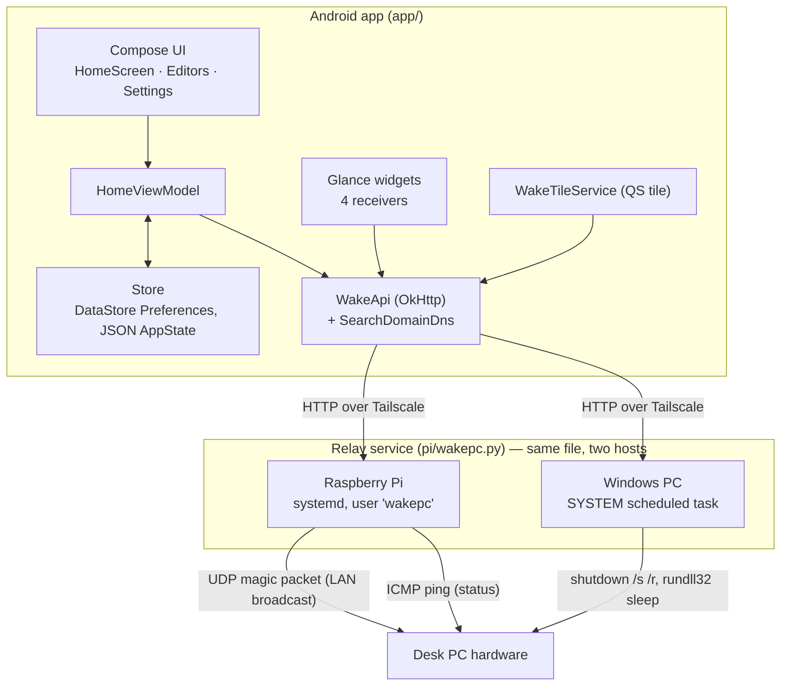

# WakePC — Engineering Record

The master record for this project: what it is, why it is shaped this way, and
what is still owed. Plain-language companion: [FIELD-GUIDE.md](FIELD-GUIDE.md).

## System

**Layering:** UI → `HomeViewModel` → `WakeApi` (interface, fakeable) → OkHttp.
`Store` owns the single `AppState`, serialised as JSON into DataStore
Preferences. Widgets bypass the ViewModel and call `WakeApi` directly, because a
Glance `ActionCallback` has no lifecycle to host one.

**Wire protocol** (`pi/wakepc.py`): `GET /commands`, `POST /run/<name>`,
`GET /status/<name>?count=N`, legacy `/wake` + `/status`, plus `/` (HTML panel)
and `/qr.png`. Auth is a bearer token; 8 failures in 5 minutes locks the caller
out. Commands are *named entries in the relay's own config* — the client can
never supply a shell string.

## Decision log

Newest first. Each entry: the decision, why, and what it replaced.

### Confirmation codes replace the "token" as the user-facing gate — 0.11.0

Two codes live in `AppState`: `shortPin` (4 digits, ordinary commands) and
`longPin` (6 digits, disruptive ones). `CommandRef.elevated` picks which,
defaulted by `looksDisruptive(name)` (regex over shutdown/restart/reboot/
sleep/suspend/hibernate/logoff) and overridable per command in the editor.
`HomeScreen` routes every press through a `Pending` record and `PinPrompt`.

*Why:* the relay token was real security but bad ergonomics — the user had to
transcribe a passphrase into settings, and it did nothing to stop a mis-tap
shutting down a running machine. Reframing it as a confirmation gate makes the
thing the user types serve the purpose they actually cared about. **Superseded:**
`cleanToken` heuristics as the primary path (kept, but no longer the focus).

*Widget exception:* a Glance tap cannot host a dialog, so widgets are authorised
**once at placement** — `WidgetConfigActivity` shows `PinPrompt` before writing
`authorisedKey = "yes"` into that instance's prefs. `RunAction` refuses with
`NOT AUTHORISED` when a gate exists and the flag is absent. This is a deliberate
trade: placing a widget *is* the act of consent.

*Debt:* the codes are stored in cleartext in DataStore, and the relay token is
now literally the PIN. Acceptable only because the whole surface is inside a
tailnet; see **Open questions**.

### One card per machine, commands from several relays — 0.10.0

`CommandRef.connectionId` (null = the machine's own). `AppState.connectionFor()`
resolves per command; the machine editor fetches `/commands` from *every*
connection and groups them under coloured headers.
*Why:* the PC is woken through the Pi but shut down through itself, which
otherwise forced two cards for one physical machine. **Replaced:** one machine =
one connection.

### The PC runs the same relay, rather than the Pi SSH-ing into it — 0.9.0

`pc/install.ps1` installs `wakepc.py` on Windows. Unelevated → a VBS shim in the
Startup folder; elevated → a SYSTEM scheduled task that runs at boot.
*Why:* the SSH design (Pi holds Windows credentials, runs a desktop batch file)
was explicitly parked by the user as too complicated, and it meant storing
Windows credentials on the Pi. Running the same service removes both.
*Constraint discovered:* Task Scheduler on this machine refuses **user** tasks
(proved with a bare `cmd.exe` probe task) — hence the Startup-folder fallback.
*Constraint discovered:* `pythonw` has no stdout, so the first `print` killed the
service; the runner now redirects to `%LOCALAPPDATA%\WakePC\wakepc.log`.

### Resolve bare MagicDNS names ourselves — 0.8.x

`SearchDomainDns` appends the network's search domains to a dotless hostname
that fails to resolve.
*Why:* Android does not apply DNS search domains to app lookups, so `pi-nd`
worked in a browser but not in the app. **Replaced:** telling the user to type
the full `<host>.<tailnet>.ts.net` form.

### R8 back on, with explicit keep rules — 0.7.x

*Why:* 0.7.0 would not launch at all. Root cause (found on an emulator, after two
wrong theories about resource shrinking and Glance protobuf): R8 stripped
`androidx.work.impl.WorkDatabase_Impl`, so `androidx.startup.InitializationProvider`
threw before `MainActivity`. A second, quieter instance of the same class of bug
left widgets on a permanent spinner — WorkManager only *logs*
`OverwritingInputMerger has no zero argument constructor`, so nothing crashed.
Keep rules now cover Room `_Impl`s, WorkManager `InputMerger`/`ListenableWorker`
constructors, Glance `ActionCallback`s and widget classes, and the tile service.
*Method that settled it:* isolate by build type — minified dumped a
`ProgressBar`, unminified a `TextView`, via `uiautomator dump`.

### Public repo, rewritten history — after 0.6

`git-filter-repo` twice: once to scrub real infra values (Tailscale IPs, MAC,
LAN IP, hostname, tokens) into placeholders, once more because two post-rewrite
commits carried a personal email from the *global* git config. Repo-local
identity is now set.
*Standing rule:* only placeholders in tracked files — `test-token`,
`100.64.0.2`, `AA:BB:CC:DD:EE:FF`, `192.168.1.50`, `homepi`.

### Named commands, never client-supplied shell — 0.5.0

The relay registry (`[command:<name>]`, `run = WOL <mac>` or `run = shell <cmd>`)
is the security boundary. A compromised phone can only invoke the list you
already wrote down. This is the most load-bearing design choice in the project
and should not be relaxed.

### The M1 design direction — 0.4.0

The user rejected the first build as "big clanky" and, from a set of A/B hybrids
and rearrangements, chose M1: console/terminal aesthetic, machine cards with chip
rows, one configurable hero button. Mockups kept in `design/`.
*Consequence:* everything is monospace `ConsoleText` on a dark `Palette`; avoid
stock Material components, which read as generic.

### A Pi relay at all — 0.1.0

A magic packet is a LAN broadcast; it cannot cross the internet or a routed VPN.
Something already at home must send it. Tailscale carries the phone→Pi hop so
nothing is exposed to the internet and no ports are forwarded.

## Toolchain

- **AGP 9** — no `kotlin-android` plugin, `buildConfig` must be opted in, and
  only `testDebugUnitTest` exists (there is no `test` lifecycle task).
- **detekt** + **spotless(ktlint)** for Kotlin, **ruff** for Python, GitHub
  Actions for CI.
- Release is minified and **debug-signed** on purpose: a personal sideload, and
  a stable key keeps upgrades friction-free.
- Version lives only in `app/build.gradle.kts`; the settings screen reads
  `BuildConfig.VERSION_NAME`.

**Gotcha, recurring:** editing `build.gradle.kts` with `sed -i` rewrites line
endings and breaks `spotlessKotlinGradleCheck`. Always run `spotlessApply` after
a version bump, and let `spotlessCheck detekt testDebugUnitTest` pass *before*
pushing.

**Gotcha:** PowerShell's `-Encoding utf8` writes a BOM, which made configparser
throw `MissingSectionHeaderError`. Fixed on both sides — write without a BOM,
read with `utf-8-sig` — and covered by a regression test.

## Testing

34 unit tests (`app/src/test/`), covering `AppState` resolution and gating, the
paste-cleaning heuristics, saver round-trips, and the relay's config parsing.
The manual rig that has repeatedly earned its keep: emulator AVD
`Medium_Phone_API_36.1` plus a local `pi/wakepc.py` acting as a mock relay, with
`uiautomator dump` to prove whether a widget actually composed.

Widget placement can only be automated with `input motionevent DOWN/MOVE/UP`
(long-press, then move) — `input swipe` and `input draganddrop` do **not** place
widgets.

## Open questions and debts

- **Codes are stored in cleartext** and double as the relay bearer token. If this
  ever leaves the tailnet, that has to change (Keystore, or a token distinct from
  the confirmation code).
- **No lockout on the app-side prompt** — the relay throttles, the dialog does
  not.
- **Widget authorisation is per instance and permanent.** No way to revoke short
  of removing the widget.
- **The PC's SYSTEM service cannot be restarted unelevated**, so a token change
  currently means either an elevated shell or a reboot.
- Boot-time SYSTEM startup on the PC is installed but **not yet proven by an
  actual reboot**.
