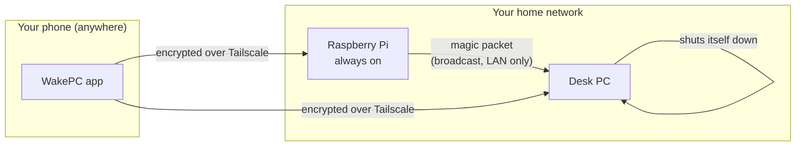
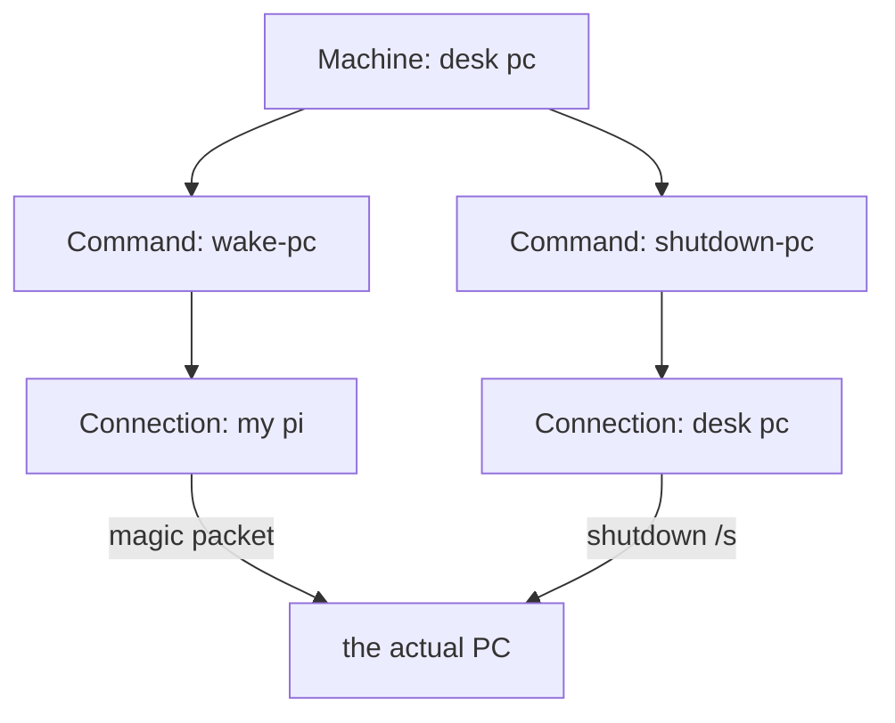
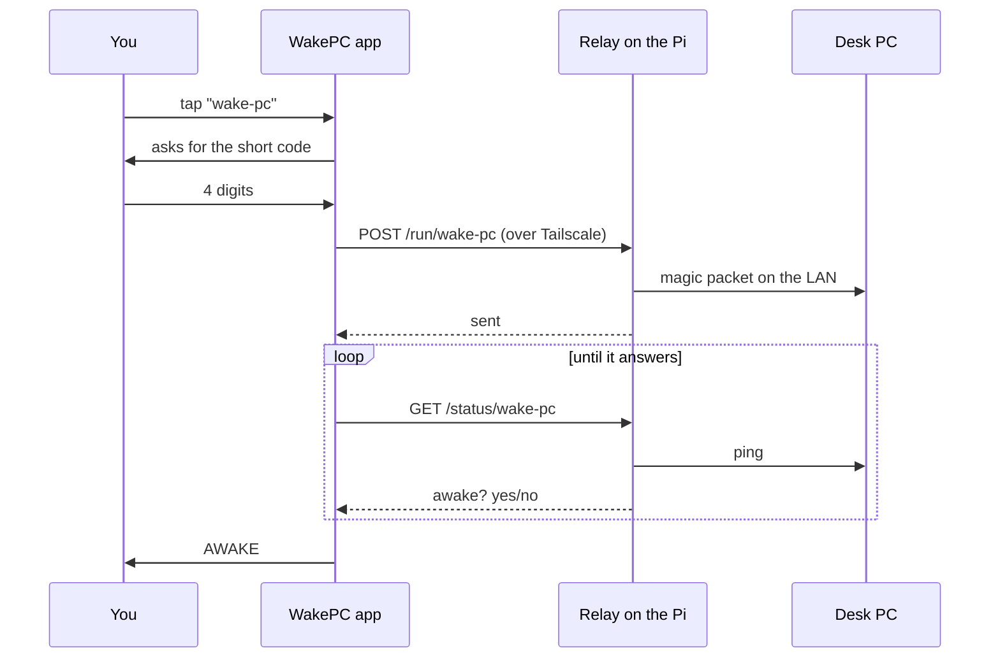

# WakePC — Field Guide

This explains what WakePC is, what every piece does, and how they fit together.
No code required. If you read only one document, read this one.

## What problem it solves

Turning on a PC you are not sitting next to used to mean: open an SSH app on the
phone, connect to the Raspberry Pi, find a saved snippet, paste it, hope. WakePC
replaces that with **one tap** — and tells you whether it actually worked.

It has since grown to run other commands too (restart, sleep, lock), on more than
one machine.

## The one constraint that shapes everything

A **Wake-on-LAN magic packet** is a broadcast on your home network. It cannot
travel across the internet, and it cannot cross a VPN, because VPNs route traffic
rather than broadcast it.

So *something already at home* has to send it. That is the Pi. Everything else in
the design follows from this single fact.

The mirror image is also true: only a machine that is **already running** can turn
itself off. So shutdown does not come from the Pi — it comes from the PC itself.



## The pieces

### Tailscale — the private network

Tailscale puts your phone, your Pi and your PC on one private network, wherever
they physically are. Traffic between them is encrypted, and nothing else on the
internet can reach them. It means **no port forwarding and no exposing anything
to the internet**.

Practically: every machine gets a `100.x.y.z` address that only your devices can
reach.

### The relay service (`pi/wakepc.py`) — the thing that does the work

A small Python program, about 500 lines, using nothing but what Python ships
with. It runs on the Pi, and the *same* program also runs on the Windows PC.

It offers a short list of **named commands** that you define in a config file:

```ini
[command:wake-pc]
run  = WOL AA:BB:CC:DD:EE:FF   # send a magic packet to this machine
ping = 192.168.1.50            # optional: lets the app show awake/asleep
```

The phone can only ask for these **by name**. It can never send a command of its
own. That is the core security idea: even if someone got hold of your phone, they
could only do the handful of things you already decided were allowed.

It also serves a small web page (a "panel") you can open in any browser on your
tailnet, to run the same commands from a computer.

### The Android app (`app/`) — what you actually touch

Written with **Jetpack Compose** (the modern way to build Android screens — you
describe what the screen should look like, and it redraws itself when data
changes) and **Kotlin**.

Three concepts, and it is worth being precise because they are easy to confuse:

| Concept | What it is | Example |
| --- | --- | --- |
| **Connection** | A relay you can reach — an address and a credential | "my pi", "desk pc" |
| **Machine** | A thing you control, shown as a card | "desk pc" |
| **Command** | A button on that card, served by some connection | `wake-pc`, `shutdown-pc` |

The important subtlety: **a machine's commands can come from different
connections.** Your PC is woken *through the Pi* (it is off, so it cannot answer
for itself) but shut down *through itself*. Both buttons sit on one card.



### Confirmation codes

Buttons that turn machines off should not fire from a pocket. So running a
command asks for a code first:

- **Short code (4 digits)** — ordinary commands like waking.
- **Long code (6 digits)** — anything that disrupts a running machine:
  shutdown, restart, sleep.

Commands are marked as needing the long code automatically when their name says
so (anything with *shutdown*, *restart*, *reboot*, *sleep*, *suspend*), and you
can change that per command.

**Widgets are the exception**, deliberately. A home-screen widget cannot stop and
ask you for a code mid-tap. So it asks **once, when you place it** — entering the
code there is how you grant that widget its one-tap power. A widget placed
without a code refuses to run and says so.

### The home-screen widget

Built with **Glance**, which is Compose for widgets. Comes in four sizes (1×1
icon, 2×1, 2×2, 4×2). Each widget you place points at whichever machine and
command you choose.

Widgets are heavily restricted by Android: they get a few seconds per tap, so a
tap fires the command and takes one quick look at the result. The refresh control
and a periodic update pick up what happens after that. They also cannot animate,
which is why they look flatter than the app.

## How a wake actually flows



## Where things live

| Where | What |
| --- | --- |
| `app/` | The Android app |
| `pi/` | The relay service and its Linux installer |
| `pc/` | Installing the same service on Windows |
| `design/` | The original design mockups |
| `docs/` | This guide and the engineering record |

## Things worth knowing

- **The app never stores a shell command.** All it knows is a list of names.
- **Status is a real ping**, done by the relay on your LAN, so "awake" means the
  machine genuinely answered — not that a packet was sent hopefully.
- **The console** (tap the `>` line above the main button) lists every request the
  app has made with how long it took, which is the fastest way to see why
  something did not work.
- **Nothing is in the cloud.** There is no server of mine or anyone else's in the
  path; it is your phone talking to your own machines.
